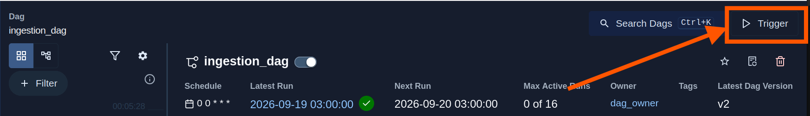
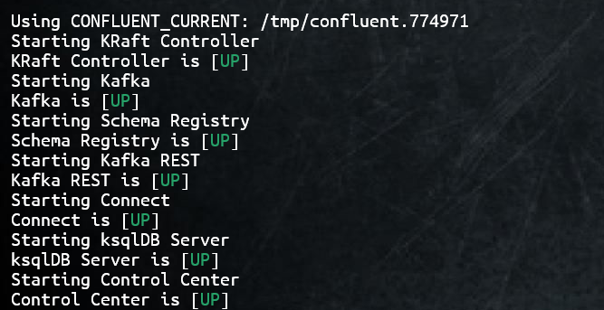
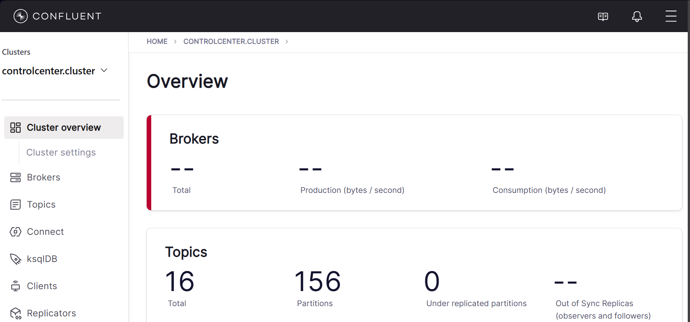
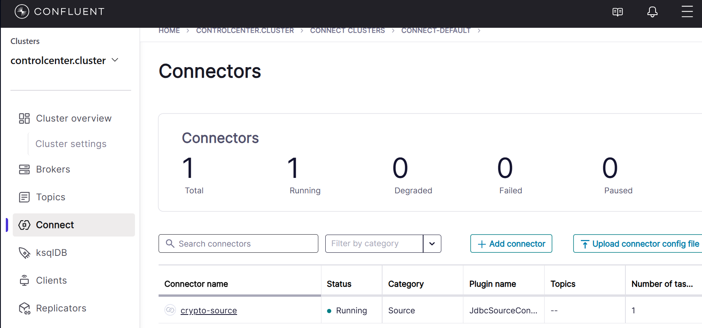
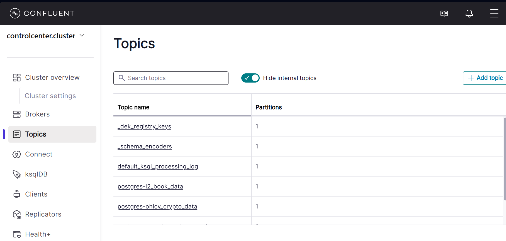
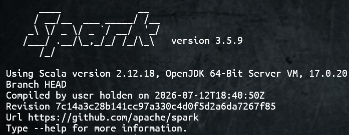
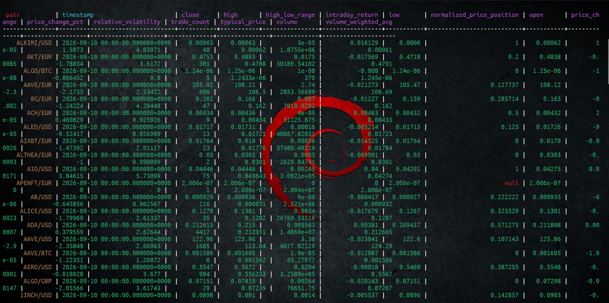

# Crypto Market Data Pipeline with Kraken
## Contents
1. [Project Overview](#project-overview)
2. [Tech stack](#tech-stack)
3. [Prerequisites](#prerequisites)
4. [Project Structure](#project-structure)
5. [Project Architecture](#project-architecture)
6. [Environment Setup](#environment-setup)
7. [Running the Pipeline](#running-the-pipeline)

## 1. Project Overview
This is an end-to-end cryptocurrency market data pipeline designed to collect, process, and serve data for analysis. The project asynchronously extracts data from the [Kraken API](https://docs.kraken.com), validates the raw data structure, and stores it in a PostgreSQL database for staging. Kafka streams this data, and through Spark Structured Streaming, Apache Spark consumes the streams and calculates real-time market metrics before storing the data in Cassandra to serve downstream users.

## 2. Tech Stack
1. Python
2. Airflow
3. PostgreSQL
3. SQLAlchemy
4. Pandas
5. Apache Kafka
6. Apache Spark
7. Cassandra
8. Docker

## 3. Prerequisites
Ensure all the following are installed:
1. [Airflow](https://airflow.apache.org/docs/apache-airflow/stable/start.html)
2. [PostgreSQL](https://www.postgresql.org/docs/current/tutorial-install.html)
3. [Confluent Platform](https://docs.confluent.io/platform/current/get-started/platform.html) and [CLI](https://docs.confluent.io/confluent-cli/current/overview.html)
4. [Apache Spark 3.5.X](https://spark.apache.org/downloads.html)
5. [Docker](https://docs.docker.com/engine/install/)
5. [Cassandra](https://cassandra.apache.org/doc/4.1/cassandra/getting_started/installing.html)
6. [plugin for the JDBC Source connector for Confluent](https://docs.confluent.io/kafka-connectors/jdbc/current/source-connector/overview.html#install-the-connector-using-the-confluent-cli)

## 4. Project Structure
```text
crypto_market_data_pipeline
├── README.md                      #project documentation
├── config.py                      #configuration setting
├── dags
│   └── ingestion_dag.py           #Airflow ingestion dag
├── ingestion
│   ├── __init__.py                #package initialization
│   ├── extract.py                 #data extraction logic
│   ├── ingest.py                  #ingestion entrypoint
│   ├── models.py                  #database table models definition
│   ├── schemas.py                 #pydantic schemas
│   ├── staging.py                 #data staging logic
│   └── transformers.py            #raw data simple transformations
├── main.py                        #python ingestion trigger
├── processing
│   ├── price_metrics.py           #price metrics calculation logic
│   ├── spark_schemas.py           #dataframe schema definitions
│   ├── spark_session.py           #spark session definition
│   ├── spark_transformation.py    #transformation entrypoint
│   └── volatility_metrics.py      #volatility metrics calculation
├── pyproject.toml                 #general dependicies
├── serving
│   ├── crypto.cql                 #Cassandra keyspace and table
│   ├── micro_batch_store.py       #single batch storage logic
│   └── serve.py                   #streaming storage logic
├── streaming
│   ├── consumers                  
│   │   └── spark_consumer.py      #spark consumer logic
│   └── producers
│       └── postgres-source-connector.json  #kafka source connector
└── uv.lock                         #specific dependencies
```

## 5. Project Architecture
This project is organized into four main components:
1. [Ingestion layer](#ingestion-layer)
2. [Streaming layer](#streaming-layer)
3. [Processing layer](#processing-layer)
4. [Serving layer](#serving-layer)

### 1. Ingestion Layer
Raw data from the Kraken API is extracted asynchronously by implementing `asyncio` and `aiohttp` python packages. This data undergoes some simple transformations using `pandas` to create a convenient structure that can be validated using `pydantic` and then stored into the `PostgreSQL` staging database.
### 2. Streaming Layer
The `confluent jdbc source connector` within the `Kafka connect platform` acts as the Kafka producer providing a connection between `Kafka` and the staging database. Once the connector is loaded, Kafka topics are automatically generated based on the table names in the staging database.<br>
`Spark structured streaming` consumes the streams from the kafka topics and avails them for batch-like Spark transformations. Spark and Kafka are integrated by using a `Spark-sql-kafka connector` by Apache.
### 3. Processing Layer
The streams are organized into `Pyspark dataframes` which are then used to calculate price and volatility metrics required by downstream users. These calculations are carried out using `Spark SQL operations`.
### 4. Serving Layer
The resulting transformations for the streams are uploaded to `Cassandra`, making them available for analysis by downstream users. Apache's `Spark-Cassandra Connector` connects spark and Cassandra.

### General Architecture
```text
  ________
 | Airflow|
 |________|
      | Trigger
      ↓
 ________________
|Ingestion layer |
|----------------|            __________    
|   Extract      |←----------|Kraken API|
|      ↓         |           |__________|  
|  Transform     |
|      ↓         |
|    Stage       |
|_______↓_________|
|  PostgreSQL    |
|________________|
        | Confluent JDBC source connector
        ↓
 _______________
|Streaming layer|
|---------------|
|    kafka      |
|    connect    |
|_______________|
|    Confluent  |
|    kafka      |
|    Plaftform  |
|_______________|
        | spark-sql-kafka-connector
        ↓
_________________
|Processing layer|
|----------------|
|   Spark        |
|  Structured    |
|  Streaming     |
|________________|
        | Spark-cassandra connector
        ↓
 _____________
|Serving layer|
|-------------|
| Cassandra   |
| Database    |
|_____________|
```

## 6. Environment Setup
### 1. Cloning the Project
clone the project and switch to the project directory
```bash
$ git clone <project repository>
$ cd crypto_market_data_pipeline
```
### 2. Environment configurations
#### Setup the .env file
Create a .env file and copy paste the details inside the [.env.example](.env.example) file. Replace the configuration values with your own.
```bash
touch .env
```
#### Setup the confidention.properties file
Change the directory to `streaming/producers` and create a confidential.properties file. Copy paste details from the [example_confidential.properties](streaming/producers/example_confidential.properties) file and replace the configuration values with your own.
```bash
$ cd streaming/producers
$ touch confidential.properties
```
This file is a [`file configuration provider`](https://kafka.apache.org/40/configuration/configuration-providers/) that will house the confidential and sensitive data required by the kafka source connector.<br>
Ensure that in the `connect-distributed.properties` file found in the installed confluent platform directory contains has a file config provider defined.
```bash
$ cd confluent/etc/kafka
:~/confluent/ect/kafka$ nano connect-distributed.properties
```
Add the following text inside the file to ensure file config providers are discoverable from all directories:
```text
config.providers=fileProvider
config.providers.fileProvider.class=org.apache.kafka.common.config.provider.FileConfigProvider
```
### 3. Dependency Synchronization
To install all the depencies in [uv.lock](uv.lock) run:
```bash
uv sync
```

## 7. Running the Pipeline
### 1. Triggering the ingestion dag
While inside the project directory, start airflow.
```bash
$ uv run airflow standalone
```
Once airflow is up and running, open the airflow UI on `localhost:8080`. Navigate to the dags ribbon in the landing page, and click on your dag. Manually trigger the dag by clicking the trigger button on the top right corner. This carries out the entire ingestion process.
<div>

<figcaption align="center"><i> airflow trigger</i> </figcaption>
</div><br/>

### 2. Running the confluent platform
Start the Confluent Kafka platform using the command below:
```bash
$ confluent local services start
```
This will start `Kraft`, `Kafka`, `Connect`, `Control Center` and the `Confluent Rest` service.
<div>

<figcaption align="center"><i> Confluent platform</i> </figcaption>
</div><br/>

All these services can be viewed and managed from the `control center` on port 9021
```text
localhost:9021
```
<div>

<figcaption align="center"><i> Control Center</i> </figcaption>
</div><br/>

### 3. loading the jdbc confluent connector
To link Connect to the PostgreSQL database, the jdbc connector has to be loaded first. This can be done using the confluent CLI or the Confluent REST service.<br/>
#### The confluent CLI:
```bash
$ conflent local services connect load connector_name --config <path_to_connector_configuration>
```
The `connector configuration` in this project is the file [`postgres-source-connector.json`](postgres-source-connector.json)
#### Confluent REST:
```bash
$ curl -X POST http://localhost:8083/connectors -H "Content-Type: application/json" -d@path_to_connector_configuration
```
View the loaded connector under `Connect` in the `Control Center`.

<div>

<figcaption align="center"><i> Loaded JDBC Connector</i> </figcaption>
</div><br/>

Navigate to `Topics` in the Control Center to view the topics created.

<div>

<figcaption align="center"><i> Topics Created</i> </figcaption>
</div><br/>

### 4. Running Spark
The spark connectors can be triggered by running `spark-submit`. Connectors are passed as values of the `--packages` flag and their structure is as follows:<br/><br/>
**spark-sql-kafka connector:** org.apache.spark:spark-sql-kafka-0-10_SCALA_VERSION:SPARK_VERSION<br/>
**spark-cassandra connector:**  com.datastax.spark:spark-cassandra-connector_SCALA_VERSION:SPARK_VERSION<br/><br/>
Obtaining the Scala and Spark version of the project is essential in determining the appropriate connectors.
```bash
$ spark-submit --version
```
<div>

<figcaption align="center"><i> Spark and version</i> </figcaption>
</div><br/>
Considering the versions in the example above, the connectors can be started by:
<br/>
<br/>

```bash
$ uv run spark-submit --packages org.apache.spark:spark-sql-kafka-0-10_2.12:3.5.9,com.datastax.spark:spark-cassandra-connector_2.12:3.5.1 serving/serve.py
```
This will connect to kafka and read the streams, and also connect to cassandra and write the processed data.
### 5. Viewing the serving tables
Open cassandra's cqlsh interactive shell and run CQL queries to output your tables.
```bash
#Open Cassandra running on Docker
$ docker start cassandra
$ docker exec -it cassandra cqlsh
# select from keyspace.table
cqlsh> SELECT * FROM crypto.market_metrics;
```
<div>

<figcaption align="center"><i> Market metrics Table</i> </figcaption>
</div><br/>